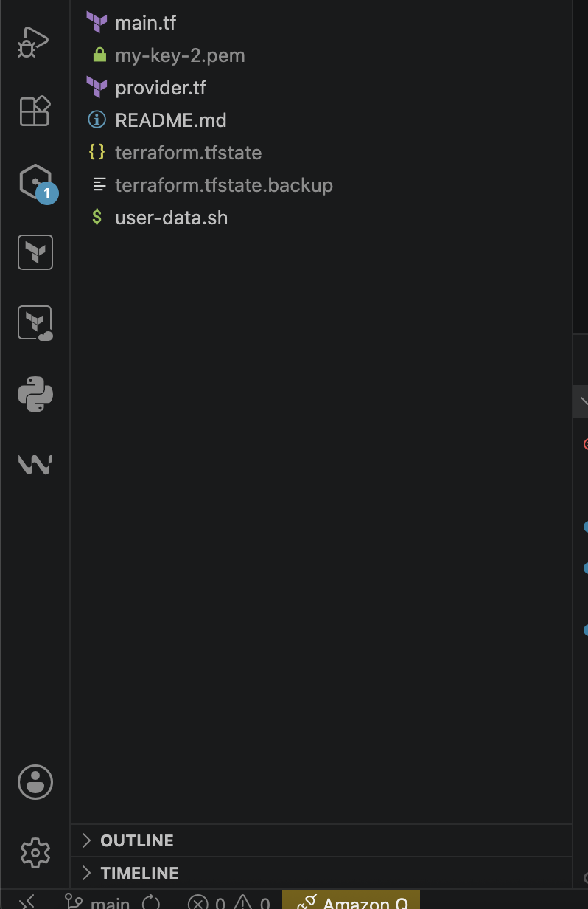
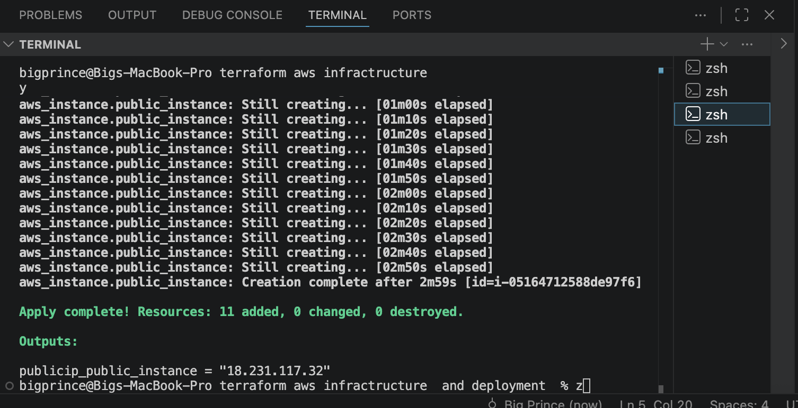
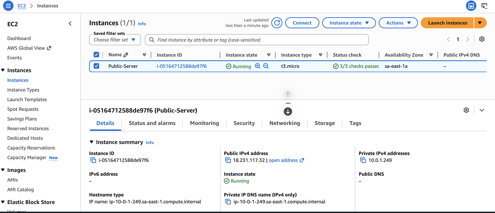
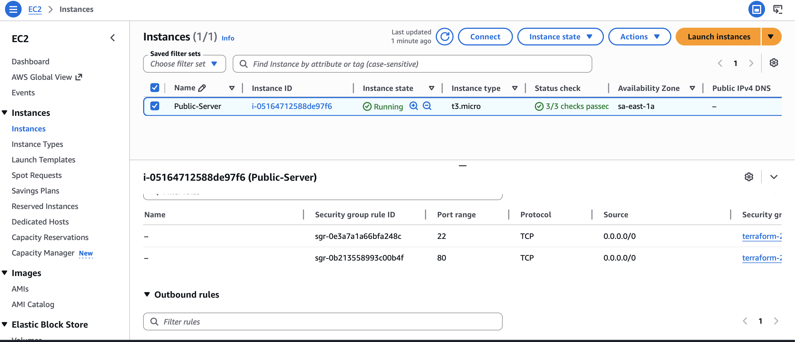
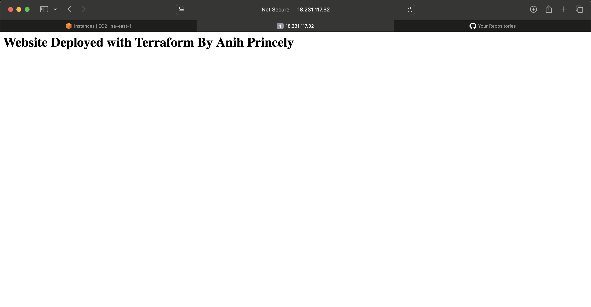

# Terraform AWS Infrastructure and Deployment

## Overview

This project deploys AWS infrastructure using Terraform.

Resources deployed include:

- AWS EC2 Instance
- Security Groups
- VPC Networking
- User Data Automation Script

---

## Project Structure

```bash
.
├── main.tf
├── provider.tf
├── user-data.sh
└── README.md
```

---

## Technologies Used

- Terraform
- AWS
- Bash
- VS Code

---

## Setup Instructions

### Initialize Terraform

```bash
terraform init
```

### Validate Configuration

```bash
terraform validate
```

### Preview Deployment

```bash
terraform plan
```

### Deploy Infrastructure

```bash
terraform apply
```

### Destroy Infrastructure

```bash
terraform destroy
```

---

## Features

- Infrastructure as Code
- Automated EC2 provisioning
- Reusable deployment configuration
- Automated web server setup

# Screenshots

## Project Structure



---

## Terraform Apply



---

## EC2 Instance Running



---

## Security Group



---

## Website Running



---

## Author

Anih Princely